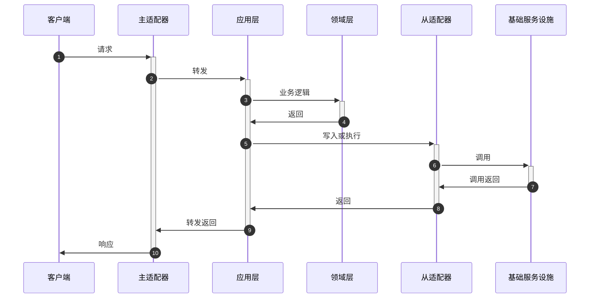

# 架构与相关

## 六边形架构
>hexagonal architecture / port and adaptor architecture / 六角架构 / 端口和适配器架构<br/>
>让用户、程序、自动化测试和批处理脚本可以平等地驱动应用，让应用的开发和测试可以独立于其最终运行的设备和数据库。<br/>
>出处 [Hexagonal architecture](http://alistair.cockburn.us/Hexagonal+architecture)<br/>
>[Ports & Adapters Architecture](https://herbertograca.com/2017/09/14/ports-adapters-architecture/)<br/>
>[端口和适配器架构(译)](https://www.jianshu.com/p/f39f4537857e)<br/>
>[六边形架构入门与实践](https://www.jianshu.com/p/c2a361c2406c)


### 架构的分层


六边形架构分层分为内部和外部两个区域，应用层和领域层在内部区域, 基础设施和其他系统在外部区域，内外通过端口进行交互。

图中每一条边表示不同的出口和入口，六条边并不意识着架构只有确定的六个出口和入口，而表示若干个。

### 六边形架构几个主要概念: 

1. 领域层(domain), 领域层负责系统业务逻辑, 即整个系统最高层和抽象的部分
2. 应用层(application), 定义系统可以完成的工作，很薄的一层。它并不处理业务逻辑通过协调领域对象或领域服务完成业务逻辑，并通过输入端口输出结果。也可以在这一层进行事物管理。
3. 端口(port), 对消费者不可感知的出入口, 多数语言里就是接口(interface), 比如搜索引擎执行搜索的接口, 在我们程序里, 我们把接口在不知其具体实现情况下做为出入口, 而后其实现会依赖注入到接口定义的地方。
4. 适配器(adapter), 是一个类, 转发(适配)一个接口到另一个接口，比如一个适配器类实现了一个接口A, 并且其注入了接口B, 当适配器类实例化的时候, 会在构造函数里注入一个实现了接口B的实例, 这个适配器类也会在接口A被需要的地方被注入， 然后其接收方法请求后转换请求并代理给实现了接口B的内部对象。
    1. 主适配器, 也叫驱动者(driving adapter), 在应用里发起动作行为
    2. 从适配器, 也叫被驱动者(driven adapter), 因为会它们对总是主适配器的行为做出反应, 代表到后端工具的连接
5. 用例(use case), 功能的业务实现

端口分为输入和输出端口两种:

1. 输入端口: 通过接口接受外部客户端调用请求, 处理请求后对外返回调用结果以提供主要服务, 比如 Controller。
2. 输出端口: 一般面向基础设施, 用来对持久化的数据、消息队列和缓存等设施进行读取与存储, 比如 Repository。

### 端口/适配器使用上的区别


* 在图的左侧，适配器依赖端口并且会被注入该端口的具体实现，其具体实现包含用例(use case)。在这方面, 端口和它的具体实现(用例)都属于应用内部。
* 在图的右侧，适配器就是端口的具体实现，并且它会被被注入到我们的业务逻辑中，即使我们的业务逻辑只知道它的接口。在这方面, 端口属于应用内部，而它的具体实现属于应用外部并且包装了一些外部工具。

### 时序图



### 代码演示

    通过一个简单客户信息管理（增删改查）来演示以上叙述中的一些概念。这里使用spring-web实现REST API，通过内存HashMap实现领域对象存储与检索。

新建Customer领域模型

```java
public class Customer {
    private String id;
    private String firstName;
    private String lastName;
    protected Customer() {}

    public Customer(String id, String firstName, String lastName) {
        this.id = id;
        this.firstName = firstName;
        this.lastName = lastName;
    }

    public String getId() {return id;}
    public String getFirstName() {return firstName;}
    public String getLastName() {return lastName;}

    public void changeFirstName(String firstName) {
        this.firstName = firstName;
    }
}
```

定义仓储接口

```java
public interface CustomerRepository {
    Customer get(String id);
    void add(Customer customer);
    void update(Customer customer);
    Collection<Customer> all();
}
```

实现应用层服务

```java
@Component
public class CustomerApplication {

    private CustomerRepository repository;

    @Autowired
    public CustomerApplication(CustomerRepository repository) {
        this.repository = repository;
    }

    public void create(CreateCustomerCommand command) {
        Customer customer = new Customer(UUID.randomUUID().toString(),
                command.getFirstName());
        repository.add(customer);
    }

    public Object fetch(String id) {
        return repository.get(id);
    }

    public void changeFirstName(String id, String firstName) {
        Customer customer = repository.get(id);
        assert customer != null;
        customer.changeFirstName(firstName);
        repository.update(customer);
    }

    public Collection<?> all() {
        return repository.all();
    }
}
```

实现输入接口

```java
@RestController
public class CustomerController {

    private CustomerApplication application;

    @Autowired
    public CustomerController(CustomerApplication application) {
        this.application = application;
    }

    @PostMapping("/customer")
    public ResponseEntity<Object> create(@RequestParam String firstName) {
        application.create(new CreateCustomerCommand(firstName));
        return ResponseEntity.ok(null);
    }

    @GetMapping("/customer/{id}")
    public ResponseEntity<Object> get(@PathVariable("id") String id) {
        return ResponseEntity.ok(application.fetch(id));
    }

    @PatchMapping("/customer/{id}")
    public ResponseEntity<Object> changeFirstName(@PathVariable("id") String id,
                                                  @RequestParam String firstName) {
        application.changeFirstName(id, firstName);
        return ResponseEntity.ok(null);
    }

    @GetMapping("/customers")
    public ResponseEntity<Object> all() {
        return ResponseEntity.ok(application.all());
    }

}
```

实现仓储接口

```java
@Component
public class InMemoryCustomerRepository implements CustomerRepository {

    Map<String, Customer> customerMap = new ConcurrentHashMap<>();

    @Override
    public Customer get(String id) {
        return customerMap.get(id);
    }

    @Override
    public void add(Customer customer) {
        customerMap.put(customer.getId(), customer);
    }

    @Override
    public void update(Customer customer) {
        customerMap.put(customer.getId(), customer);
    }

    @Override
    public Collection<Customer> all() {
        return Collections.unmodifiableCollection(customerMap.values());
    }
}
```


## 干净架构
>出处 [The Clean Architecture](https://blog.cleancoder.com/uncle-bob/2012/08/13/the-clean-architecture.html) <br/>
>天火的博客 [干净架构最佳实践](https://blog.jaggerwang.net/clean-architecture-in-practice/)