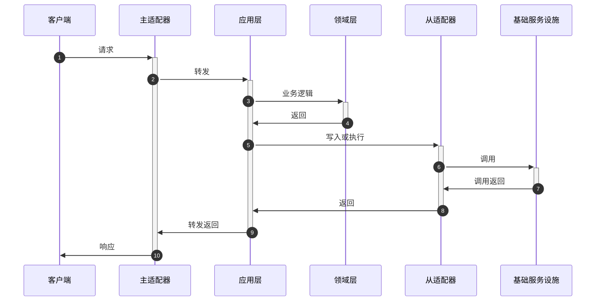

# 架构与相关

## 六边形架构
>hexagonal architecture / port and adaptor architecture / 六角架构 / 端口和适配器架构<br/>
>让用户、程序、自动化测试和批处理脚本可以平等地驱动应用, 让应用的开发和测试可以独立于其最终运行的设备和数据库。<br/>
>出处 [Hexagonal architecture](http://alistair.cockburn.us/Hexagonal+architecture)<br/>
>[Ports & Adapters Architecture](https://herbertograca.com/2017/09/14/ports-adapters-architecture/)<br/>
>[端口和适配器架构(译)](https://www.jianshu.com/p/f39f4537857e)<br/>
>[六边形架构入门与实践](https://www.jianshu.com/p/c2a361c2406c)


### 架构的分层


六边形架构分层分为内部和外部两个区域, 应用层和领域层在内部区域, 基础设施和其他系统在外部区域, 内外通过端口进行交互。

图中每一条边表示不同的出口和入口, 六条边并不意识着架构只有确定的六个出口和入口, 而表示若干个。

### 六边形架构几个主要概念: 

1. 领域层(domain), 领域层负责系统业务逻辑, 即整个系统最高层和抽象的部分
2. 应用层(application), 定义系统可以完成的工作, 很薄的一层。它并不处理业务逻辑通过协调领域对象或领域服务完成业务逻辑, 并通过输入端口输出结果。也可以在这一层进行事物管理。
3. 端口(port), 对消费者不可感知的出入口, 多数语言里就是接口(interface), 比如搜索引擎执行搜索的接口, 在我们程序里, 我们把接口在不知其具体实现情况下做为出入口, 而后其实现会依赖注入到接口定义的地方。
4. 适配器(adapter), 是一个类, 转发(适配)一个接口到另一个接口, 比如一个适配器类实现了一个接口A, 并且其注入了接口B, 当适配器类实例化的时候, 会在构造函数里注入一个实现了接口B的实例, 这个适配器类也会在接口A被需要的地方被注入,  然后其接收方法请求后转换请求并代理给实现了接口B的内部对象。
    1. 主适配器, 也叫驱动者(driving adapter), 在应用里发起动作行为
    2. 从适配器, 也叫被驱动者(driven adapter), 因为会它们对总是主适配器的行为做出反应, 代表到后端工具的连接
5. 用例(use case), 功能的业务实现, 描述行为需求

端口分为输入和输出端口两种:

1. 输入端口: 通过接口接受外部客户端调用请求, 处理请求后对外返回调用结果以提供主要服务, 比如 Controller。
2. 输出端口: 一般面向基础设施, 用来对持久化的数据、消息队列和缓存等设施进行读取与存储, 比如 Repository。

### 端口/适配器使用上的区别


* 在图的左侧, 适配器依赖端口并且会被注入该端口的具体实现, 其具体实现包含用例(use case)。在这方面, 端口和它的具体实现(用例)都属于应用内部。
* 在图的右侧, 适配器就是端口的具体实现, 并且它会被被注入到我们的业务逻辑中, 即使我们的业务逻辑只知道它的接口。在这方面, 端口属于应用内部, 而它的具体实现属于应用外部并且包装了一些外部工具。

### 时序图



### 代码演示

    通过一个简单客户信息管理(增删改查)来演示以上叙述中的一些概念。这里使用spring-web实现REST API, 通过内存HashMap实现领域对象存储与检索。

新建Customer领域模型

```java
public class Customer {
    private String id;
    private String firstName;
    private String lastName;
    protected Customer() {}

    public Customer(String id, String firstName, String lastName) {
        this.id = id;
        this.firstName = firstName;
        this.lastName = lastName;
    }

    public String getId() {return id;}
    public String getFirstName() {return firstName;}
    public String getLastName() {return lastName;}

    public void changeFirstName(String firstName) {
        this.firstName = firstName;
    }
}
```

定义仓储接口

```java
public interface CustomerRepository {
    Customer get(String id);
    void add(Customer customer);
    void update(Customer customer);
    Collection<Customer> all();
}
```

实现应用层服务

```java
@Component
public class CustomerApplication {

    private CustomerRepository repository;

    @Autowired
    public CustomerApplication(CustomerRepository repository) {
        this.repository = repository;
    }

    public void create(CreateCustomerCommand command) {
        Customer customer = new Customer(UUID.randomUUID().toString(),
                command.getFirstName());
        repository.add(customer);
    }

    public Object fetch(String id) {
        return repository.get(id);
    }

    public void changeFirstName(String id, String firstName) {
        Customer customer = repository.get(id);
        assert customer != null;
        customer.changeFirstName(firstName);
        repository.update(customer);
    }

    public Collection<?> all() {
        return repository.all();
    }
}
```

实现输入接口

```java
@RestController
public class CustomerController {

    private CustomerApplication application;

    @Autowired
    public CustomerController(CustomerApplication application) {
        this.application = application;
    }

    @PostMapping("/customer")
    public ResponseEntity<Object> create(@RequestParam String firstName) {
        application.create(new CreateCustomerCommand(firstName));
        return ResponseEntity.ok(null);
    }

    @GetMapping("/customer/{id}")
    public ResponseEntity<Object> get(@PathVariable("id") String id) {
        return ResponseEntity.ok(application.fetch(id));
    }

    @PatchMapping("/customer/{id}")
    public ResponseEntity<Object> changeFirstName(@PathVariable("id") String id,
                                                  @RequestParam String firstName) {
        application.changeFirstName(id, firstName);
        return ResponseEntity.ok(null);
    }

    @GetMapping("/customers")
    public ResponseEntity<Object> all() {
        return ResponseEntity.ok(application.all());
    }

}
```

实现仓储接口

```java
@Component
public class InMemoryCustomerRepository implements CustomerRepository {

    Map<String, Customer> customerMap = new ConcurrentHashMap<>();

    @Override
    public Customer get(String id) {
        return customerMap.get(id);
    }

    @Override
    public void add(Customer customer) {
        customerMap.put(customer.getId(), customer);
    }

    @Override
    public void update(Customer customer) {
        customerMap.put(customer.getId(), customer);
    }

    @Override
    public Collection<Customer> all() {
        return Collections.unmodifiableCollection(customerMap.values());
    }
}
```


## 干净架构
>出处 [The Clean Architecture](https://blog.cleancoder.com/uncle-bob/2012/08/13/the-clean-architecture.html) <br/>


### 依赖规则 (The Dependency Rule)

图中同心圆代表了不同的领域, 外层是机能机构, 内层是策略, 越往内部软件层级越高。

依赖规则是架构的首要原则, 此规则下代码的依赖只能从外到内, 圈内对圈外的一切都无从知晓, 尤其是圈外声明的任何名称(函数、类、变量, 或其他任何软件实体)都不能在圈内被提及。

### 实体 (Entities)

实体封装了 _企业范围_ 的业务规则。 实体可以是带有方法的对象, 也可以是一组数据结构和函数。 只要实体可以被企业中的许多不同应用程序使用, 都没关系。

如果你没有一个企业, 并且在编写一个独立的应用, 那这些实体就是应用程序的业务对象。他们封装了最通用和高层的规则。当外界发生变动时, 他们是系统中最不可能发生变动的部分。

### 用例 (Use Cases)

此层的软件包含 _特定应用_ 的业务规则, 它封装和实现的系统所有的用例, 这些用例协调进出实体的数据流, 并且指导这些实体利用其本身 _企业范围_ 的业务规则实现用例的目标。

我们不希望这一层的更改会影响实体, 我们也不希望这一层被外部的改动所影响, 比如数据库、UI和一些框架, 用例层应该和这些关注点分离。

然而, 对应用程序操作的修改, 确实会影响到用例和用例层的软件, 如果用例的细节发生变化, 那么此层中的某些代码肯定会受到影响。

### 接口适配器 (Interface Adapters)

这一层中的软件是一组适配器, 可以将数据从最适合用例和实体的格式转换为最适合某些外部机构(如数据库或Web)的格式。例如, 这一层将完全包含MVC(MVP?)架构的GUI部分, 演示器(MVP的P)、视图和控制器都属于这里, 模型只是从控制器传递到用例, 然后再从用例传递到演示器和视图的数据结构。

同样, 在这一层中, 数据从最适合实体和用例的形式转换为最适合所使用持久化框架的形式, 比如数据库: 这个圈内的代码不应该知道关于数据库的任何事情。如果数据库是SQL数据库, 那么所有的SQL都应该限制在这一层, 特别是这一层与数据库相关的部分。

而且在此层中, 也需要其他适配器将数据从某种外部形式(例如外部服务)转换为用例和实体使用的内部形式。

### 框架和驱动 (Frameworks and Drivers)

最外层通常由框架和工具(例如数据库, Web框架等)组成。通常, 除了与内圈通信的粘合代码外, 你不需要在这一层编写太多代码。

这一层是所有细节的所在。Web是一个细节, 数据库是一个细节。我们把这些不会造成太大伤害的东西放到外层。

### 只有四层? (Only Four Circles?)

圆圈图只是简图, 你可能发现自己需要更多层级, 没有规则限制你只能遵循图中的四层, 但是依赖规则一定要遵守。代码的依赖关系总是从外到内。最外面的圆圈是底层的具体细节。越往内部抽象层级越高, 往内部是封装级别更高策略。最里面的圆是最通用的。


### 跨界 (Crossing boundaries)

图的右下方是我们如何越过圆边界的示例。它显示了控制器和演示器在下一层与用例进行通信。注意控制流。它从控制器开始, 通过用例, 然后在演示器结束。另外注意代码的依赖关系, 他们都指向用例。

我们通常通过依赖倒置在边界将控制反转来解决这种矛盾。

比如, 考虑用例需要调用演示器, 但这样直接调用违反了依赖规则: 外层对象不能在内层被提及。所在我们让内圈的用例调用一个演示器接口(此处显示为用例输出端口), 然后在外圈用演示器将其实现。

把同样的技术应用到架构中的所有跨界。我们利用动态多态性来创建与控制流相反的代码依赖关系, 这样无论控制流怎么走向, 我们都可以遵循依赖规则。


### 哪种数据会跨界 (What data crosses the boundaries)

通常跨界数据都是简单的数据结构。你也可以根据个人喜好使用基础结构或简单的数据传输对象(Data Transfer objects)。或者是可以被函数当作参数调用的简单数据。亦或是把数据打包进Hashmap或打包成一个对象。重要的是跨边界传递的是隔离的, 简单的数据结构,  我们不想去欺骗并传递实体或是数据库存储的数据行。我们不希望传递的数据结构有任何(和某些特定职能服务相关的)依赖项, 从而违反了依赖关系。

比如, 很多数据库框架在响应查询时返回一个方便的数据格式, 我们可能称之为行结构(RowStructure)。我们不希望向内部跨界传递这种行结构, 那样会违反依赖规则, 因为它会导致内圈了解外圈的东西。

所有当我们跨界传递数据时, 数据应该总是以适合内圈的形式传递。

### 总结

遵守这些简单的规则并不难, 这会为你省去很多麻烦。通过将软件分层, 并遵循依赖规则, 你就能创建一个真正可测试的系统, 并享受其带来所有的好处。当外部的任何部分过时的时候, 像数据库、Web框架, 你可以用很小的代价替换掉他们。

## 其它架构

>此外还有: 尖叫架构(Screaming Architecture), 洋葱架构(Onion Architecture), DCI(Data, Context, Interactions)