# Mermaid 示例

> [返回参考](/reference/)

## 饼图

```
pie title 标题
         "数据A" : 120
         "数据B" : 40
```

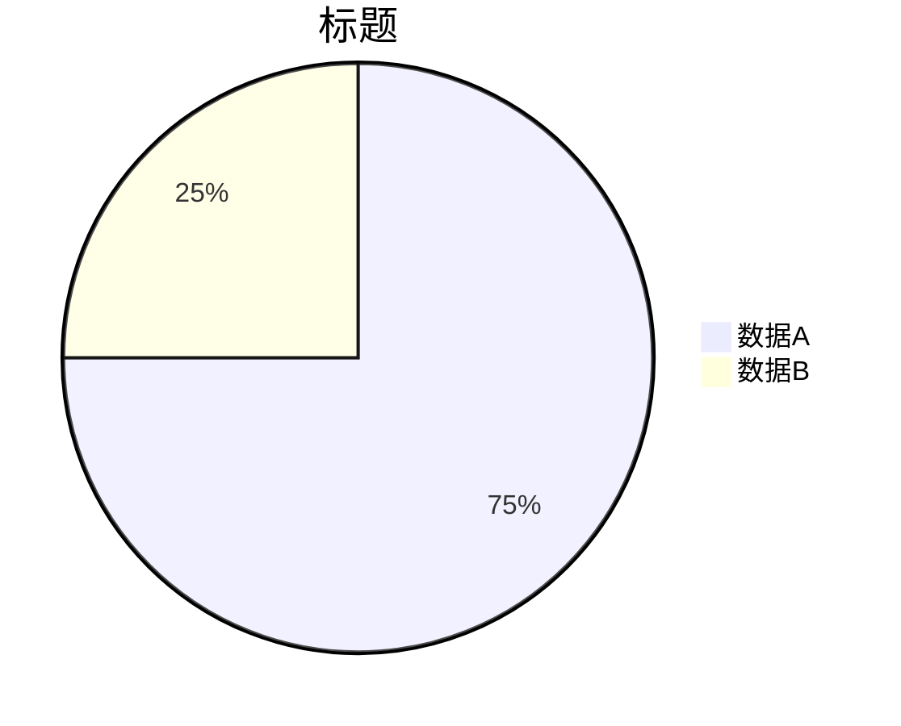

## 时序图(Sequence diagram)

* **连接线**

Type | Description
-----|--------------------------------------------
->   | Solid line without arrow
-->  | Dotted line without arrow
->>  | Solid line with arrowhead
-->> | Dotted line with arrowhead
-x   | Solid line with a cross at the end (async)
--x  | Dotted line with a cross at the end (async)

* **注解(note)**

```
sequenceDiagram
    participant John
    participant Ken
    Note right of John: Text in note
    Note over Ken: Text in note
    Note over John,Ken: Text in note
```

* **循环(loop)**

```
loop Loop text
... statements ...
end
```

* **替代方案(alternative) 即 if/else**

```
alt Describing text
... statements ...
else
... statements ...
end
```

* **可选方案(optional) 即 if without else**

```
opt Describing text
... statements ...
end
```

* **同时进行(parallel)**

```
par [Action 1]
... statements ...
and [Action 2]
... statements ...
and [Action N]
... statements ...
end
```

* **背景高亮**

```
rect rgb(0, 255, 0)
... content ...
end
```

```
rect rgba(0, 0, 255, .1)
... content ...
end
```

* **序列编号**

```
sequenceDiagram
    autonumber
    ... content ...
```

* **示例**

```
sequenceDiagram
    autonumber
    %% 提前定义参与者可以限定对象展示顺序
    participant sky as 路人甲
    participant may as 丙
    participant 乙

    %% 箭头后边跟 `+` 表示激活目标对象，跟 `-` 表示取消激活箭头起始对象
    %% 等同于在后边跟上命令：`activate <Actor>` 或 `deactivate <Actor>`
    sky ->>+ 乙: 实线箭头与激活
    may -->>+ 乙: 虚线箭头与激活
    Note left of sky: left 控制 Note 在"路人甲"左方
    %% 这是一个循环
    loop 检查权限
            may -->> may: 是否登录状态
            %% 条件判断
        rect rgba(0, 255, 0, .1)
            alt 是否授权
                may --x sky: 虚X 计划一
            else
                may --x sky: 否则计划二
            end
        end
    end
    乙 -x- may: 实线X箭头与取消激活
    乙 -->- sky: 无箭头虚线与取消激活
    Note over may,乙: Note 跨跃丙和乙
    opt 附加情况
        sky -> may: 无箭头实线
    end
```

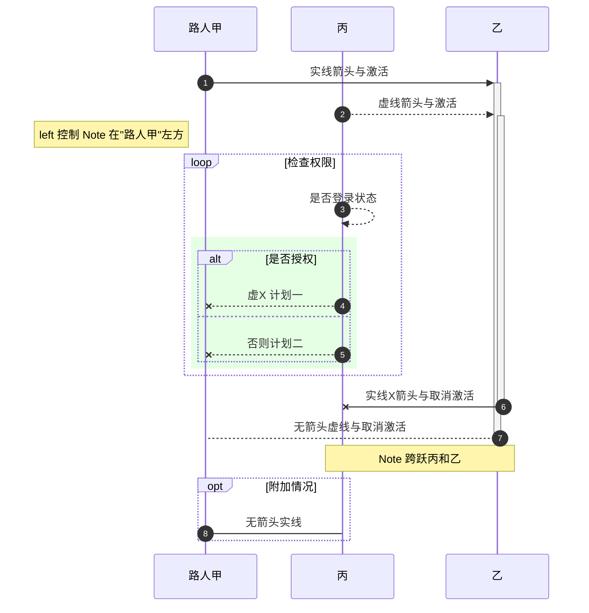


## 流程图(Flowchart)

```
graph LR
    %% LR 表示左右，TD/TB 表示上下
    %% 这里是注释不会显示到图中

    %% 可提前定义对象与形状
    asymetric>非对称+样式]
    circle((圆形))
    roundrect(圆角矩形)
    rectangle[矩形]
    rhombus{菱形}
    stadium([跑道形状加链<br/>点击跳转])
    subroutine[[子例程]]
    cylindrical[(柱形)]
    hexagon{{六边形}}
    parallelogram[/平行四边形/]
    alt-parallelogram[\平行四边形\]
    trapezoid[/梯形\]
    alt-trapezoid[\梯形/]

    subgraph subid1 [形状子图]
        asymetric -.- rectangle -.- roundrect
        rhombus -.- circle -.- cylindrical
        hexagon -.- parallelogram -.- alt-parallelogram
        subroutine -.- trapezoid -.- alt-trapezoid
        stadium
    end
    subgraph 连接子图
        %% -->  表示 实线有方向连接
        %% ---  表示 实线无方向连接
        %% -.-> 表示 虚线有方向连接
        %% -.-  表示 虚线无方向连接
        %% ==>  表示 实线有方向加重连接
        %% ===  表示 实线无方向加重连接
        %% a 使用 A 为外部名称, b 应用了 classbbb 样式
        %% & 表示同时连接到多个对象
        a[A] --> b:::classbbb & c -.-> d & e
        f -->|说明|g -- 说明 --> h
        i --- j ==> k
        i -.- j === k
    end
    roundrect -.-> Bridge[("使用时定义(对象)与(形状)#quot;引号#quot;")] -.-> a
    stadium -.-> g

    %% 定义样式与类及其应用
    classDef classbbb fill:#69f,stroke:#666,stroke-width:0px;
    class asymetric,Bridge classbbb
    style a color:#923,stroke-dasharray:5,5;
    %% 默认样式
    classDef default fill:#ececff,stroke:#999,stroke-width:1px;

    %% 定义行为，Tooltip暂不生效
    click a callback "Tooltip for a callback"
    click stadium "/#/reference/" "This is a tooltip for a link"
```


## 类图(Class diagrams)


* **定义类**

```
classDiagram
    class Animal
```

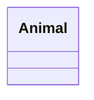

* **定义类成员**

    * `+` 表示 Public
    * `-` 表示 Private
    * `#` 表示 Protected
    * `~` 表示 Package/Internal

    > 注：你可以在括号`()`后边为方法添加标识来定义额外的类型限定
    >    * `*` Abstract e.g.: `someAbstractMethod()*`
    >    * `$` Static e.g.: `someStaticMethod()$`

```
classDiagram
    class BankAccount
    BankAccount : +String owner
    BankAccount : +Bigdecimal balance
    BankAccount : +deposit(amount)
    BankAccount : +withdrawl(amount)
```

或用大括号定义

```
classDiagram
    class BankAccount{
        +String owner
        +BigDecimal balance
        +deposit(amount)
        +withdrawl(amount)
    }
```

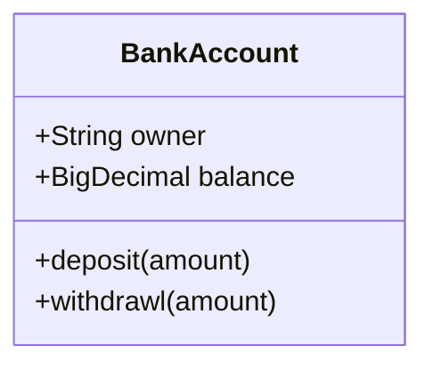

* **添加成员方法的返回值类型**

```
classDiagram
    class BankAccount{
        +String owner
        +BigDecimal balance
        +deposit(amount) bool
        +withdrawl(amount) int
    }
```

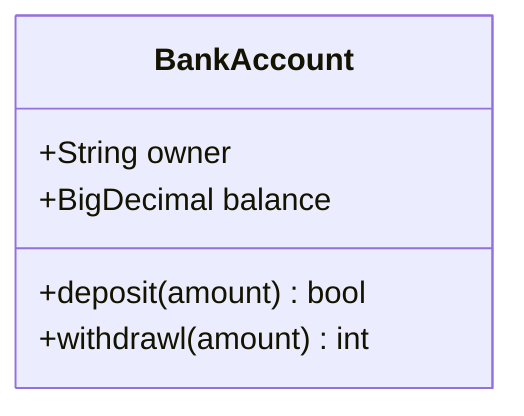

* **泛型(Generic Types)**
> 封闭的波浪符`~`(tilde)，暂不支持嵌套

```
classDiagram
    %% 两种不同方式添加成员
    class Square~Shape~{
        int id
        List~int~ position
        setPoints(List~int~ points)
        getPoints() List~int~
    }
    Square : -List~string~ messages
    Square : +setMessages(List~string~ messages)
    Square : +getMessages() List~string~
```

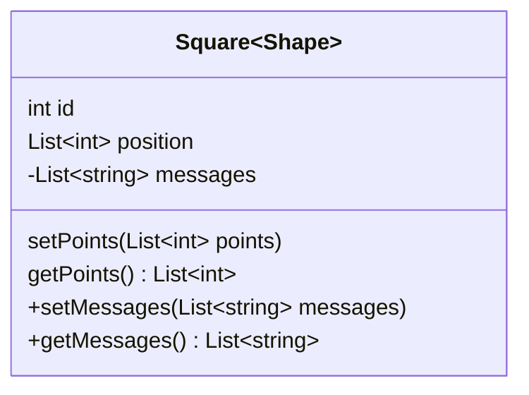

* **定义关系**

```
[classA][Arrow][ClassB]:LabelText
```

Type    | Description
--------|-------------------
`<\|--` | 继承 Inheritance
`*--`   | 组合 Composition
`o--`   | 聚合 Aggregation
`-->`   | 联合 Association
`--`    | 实线连接 Link (Solid)
`..>`   | 依赖 Dependency
`..\|>` | 实现关系 Realization
`..`    | 虚线连接 Link (Dashed)

关系演示

```
classDiagram
    classX --|> classY
    classA --|> classB : Inheritance
    classC --* classD : Composition
    classE --o classF : Aggregation
    classG --> classH : Association
    classI -- classJ : Link(Solid)
    classK ..> classL : Dependency
    classM ..|> classN : Realization
    classO .. classP : Link(Dashed)
```

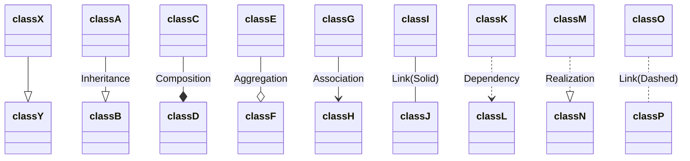

* **数量关系**

    * `0..1` Zero or one
    * `1` Only 1
    * `0..1` Zero or One
    * `1..*` One or more
    * `*` Many
    * `n n` {where n>1}
    * `0..n` zero to n {where n>1}
    * `1..n` one to n {where n>1}

```
[classA] "cardinality1" [Arrow] "cardinality2" [ClassB]:LabelText
```

示例 _数量指示\[可选\]要在箭头两端用双引号`"`引起来_
```
classDiagram
    Customer "1" --> "*" Ticket
    Student "1" --> "1..*" Course
    Galaxy --> "many" Star : Contains
```

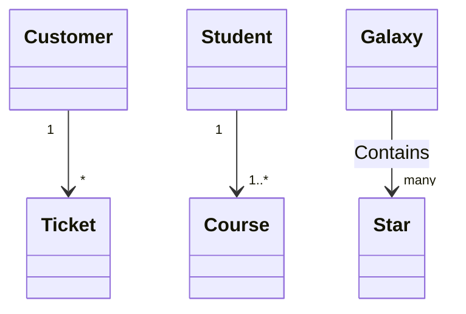


* **类的声明**

    * `<<Interface>>` 表示 Interface class
    * `<<abstract>>` 表示 abstract class
    * `<<Service>>` 表示 service class
    * `<<enumeration>>` 表示 enum

类的声明紧跟在类的定义后独立一行

```
classDiagram
    class Shape
    <<interface>> Shape
```

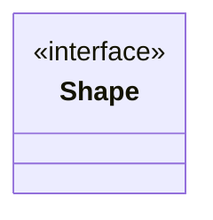

类的声明或嵌套在类的定义的结构体里边

```
classDiagram
    class Shape{
        <<interface>>
        noOfVertices
        draw()
    }
    class Color{
        <<enumeration>>
        RED
        BLUE
        GREEN
        WHITE
        BLACK
    }
```

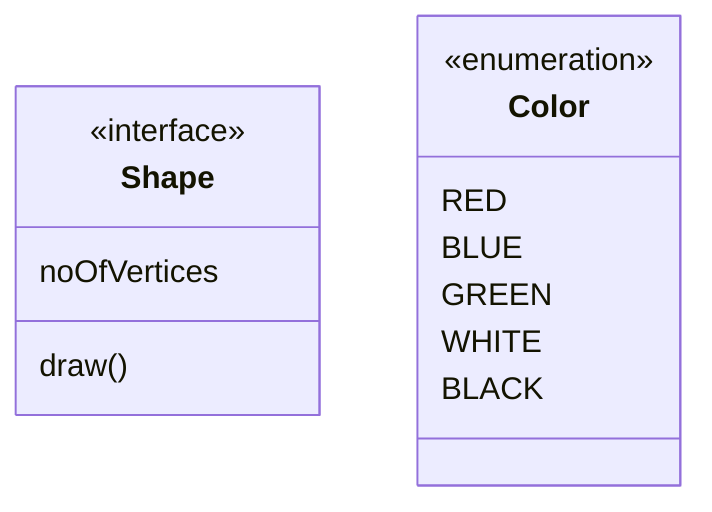

* **定义交互**

    * `action` link 或 callback
    * `className` 类节点ID
    * `reference` 超链接 或 callback 的 function name. (note: callback function will be called with the nodeId as parameter).
    * `(optional) tooltip` 划过展示的提示 (note: The styles of the tooltip are set by the class .mermaidTooltip.)

```
action className "reference" "tooltip"
```

示例:

_URL Link_:

```
classDiagram
    class Shape
    link Shape "/#/reference/" "首页"
```

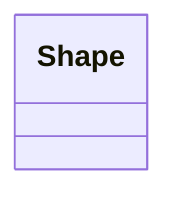

_Callback_:

```
classDiagram
    class Shape
    callback Shape "callbackFunction" "请点击"
```

```javascript
<script>
    var callbackFunction = function(){
        alert('A callback was triggered');
    }
</script>
```

<script>
    var callbackFunction = function(){
        alert('A callback was triggered');
    }
</script>


## 甘特图(Gantt diagrams)

* **语法(Syntax)**

```
gantt
        title      甘特图

        %% 输入日期格式
        dateFormat "YYYY-MM-DD"
        %% dateFormat :YYYY-MM-DD

        %% 坐标输出日期格式
        axisFormat  %Y/%m/%d

        excludes   :excludes the named dates/days from being included in a charted task..
        %% (Accepts specific dates in YYYY-MM-DD format, days of the week ("sunday") or "weekends", but not the word "weekdays".)

        section 第一部分
        项目立项                :done,    des1, 2020-06-01,1d
        需求沟通                :active,  des2, 2020-06-02, 6d
        任务划分                :         des3, after des2, 1d

        section 紧急任务
        架构设计                      :crit, done, jiagou, 2020-01-06,72h
        在某任务后                    :crit, active, after des2, 2d
        无开始时间，默认上一任务后      :crit, active, 3d
        无状态，默认未开始             :crit, 2d
        无任务级别                     :1d

        section 不设置级别
        用户模块      :active, a1, after jiagou, 3d
        日志系统      :after a1  , 20h
        测试          :48h
```

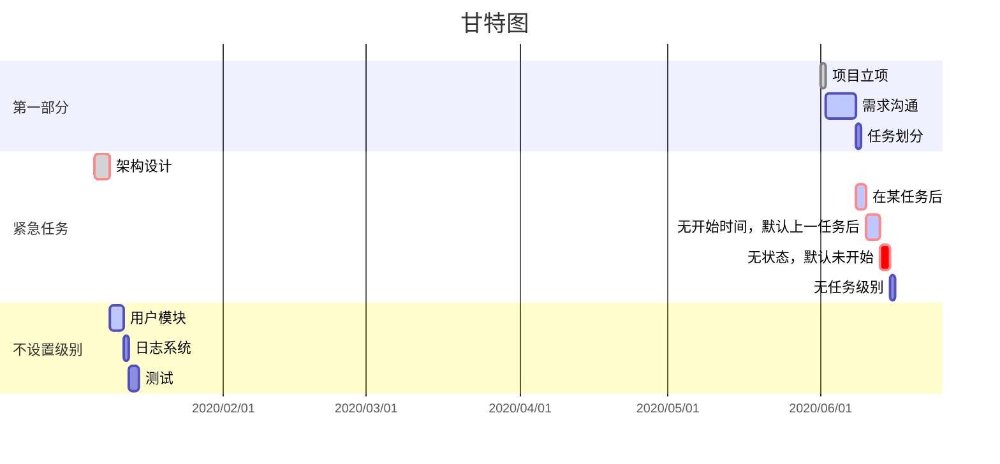

* **日期格式**

Input    | Example        | Description:
---------|----------------|-------------------------------------------------------
YYYY     | 2014           | 4 digit year
YY       | 14             | 2 digit year
Q        | 1..4           | Quarter of year. Sets month to first month in quarter.
M MM     | 1..12          | Month number
MMM MMMM | January..Dec   | Month name in locale set by moment.locale()
D DD     | 1..31          | Day of month
Do       | 1st..31st      | Day of month with ordinal
DDD DDDD | 1..365         | Day of year
X        | 1410715640.579 | Unix timestamp
x        | 1410715640579  | Unix ms timestamp
H HH     | 0..23          | 24 hour time
h hh     | 1..12          | 12 hour time used with a A.
a A      | am pm          | Post or ante meridiem
m mm     | 0..59          | Minutes
s ss     | 0..59          | Seconds
S        | 0..9           | Tenths of a second
SS       | 0..99          | Hundreds of a second
SSS      | 0..999         | Thousandths of a second
Z ZZ     | +12:00         | Offset from UTC as +-HH:mm, +-HHmm, or Z


* **坐标输出格式日期(axisFormat)**

```
axisFormat  %Y-%m-%d
```

```
%a - abbreviated weekday name.
%A - full weekday name.
%b - abbreviated month name.
%B - full month name.
%c - date and time, as "%a %b %e %H:%M:%S %Y".
%d - zero-padded day of the month as a decimal number [01,31].
%e - space-padded day of the month as a decimal number [ 1,31]; equivalent to %_d.
%H - hour (24-hour clock) as a decimal number [00,23].
%I - hour (12-hour clock) as a decimal number [01,12].
%j - day of the year as a decimal number [001,366].
%m - month as a decimal number [01,12].
%M - minute as a decimal number [00,59].
%L - milliseconds as a decimal number [000, 999].
%p - either AM or PM.
%S - second as a decimal number [00,61].
%U - week number of the year (Sunday as the first day of the week) as a decimal number [00,53].
%w - weekday as a decimal number [0(Sunday),6].
%W - week number of the year (Monday as the first day of the week) as a decimal number [00,53].
%x - date, as "%m/%d/%Y".
%X - time, as "%H:%M:%S".
%y - year without century as a decimal number [00,99].
%Y - year with century as a decimal number.
%Z - time zone offset, such as "-0700".
%% - a literal "%" character.
```