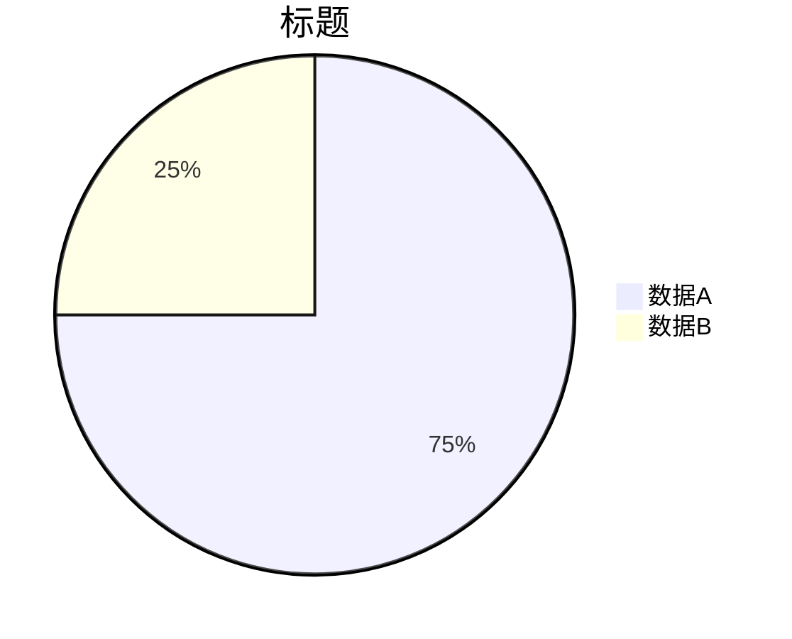
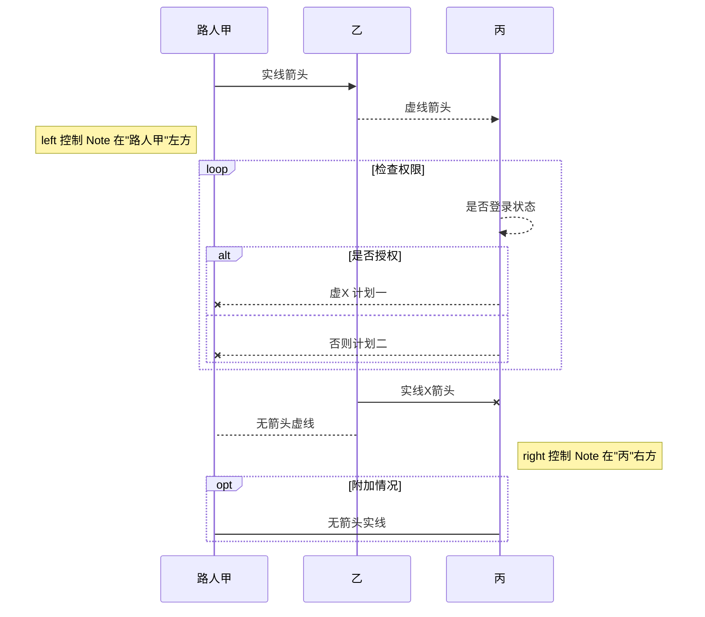
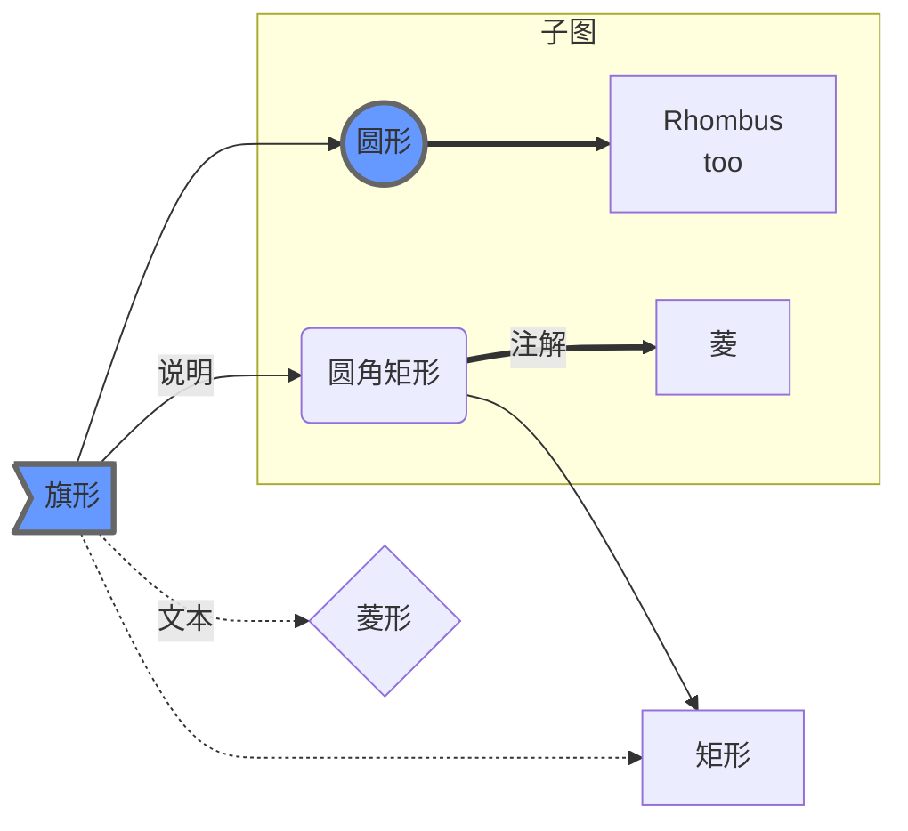

# Mermaid 示例

> [返回参考](/reference/)

## 饼图

```
pie title 标题
         "数据A" : 120
         "数据B" : 40
```



## 时序图

```
sequenceDiagram
    路人甲 ->> 乙: 实线箭头
    乙-->>丙: 虚线箭头
    Note left of 路人甲: left 控制 Note 在"路人甲"左方
    %% 这是一个循环
    loop 检查权限
        丙-->>丙: 是否登录状态
        %% 条件判断
        alt 是否授权
            丙--x 路人甲: 虚X 计划一
        else
            丙--x 路人甲: 否则计划二
        end
    end
    乙-x 丙: 实线X箭头
    乙-->路人甲: 无箭头虚线
    Note right of 丙: right 控制 Note 在"丙"右方
    opt 附加情况
        路人甲->丙: 无箭头实线
    end
```




## 流程图

```
graph LR
    %% LR 表示左右，TB 表示上下
    %% 这里是注释不会显示到图中
    A>旗形]
    tony((圆形))
    C(圆角矩形)
    D[矩形]
    E{菱形}
    %% 对象可以提前统一定义，然后在图中应用

    A --> tony
    A -- 说明 --> C
    A -.-> D
    A -. 文本 .-> E

    subgraph 子图
        tony ==> F[Rhombus<br/>too]
        C == 注解 ==> G[菱]
    end
    C --> D

    classDef bbb fill:#69f,stroke:#666,stroke-width:3px;
    class A,tony bbb
```

