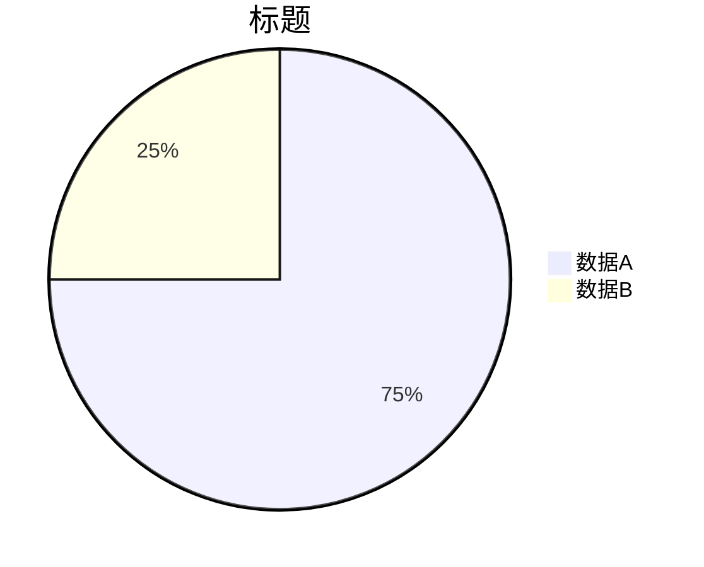
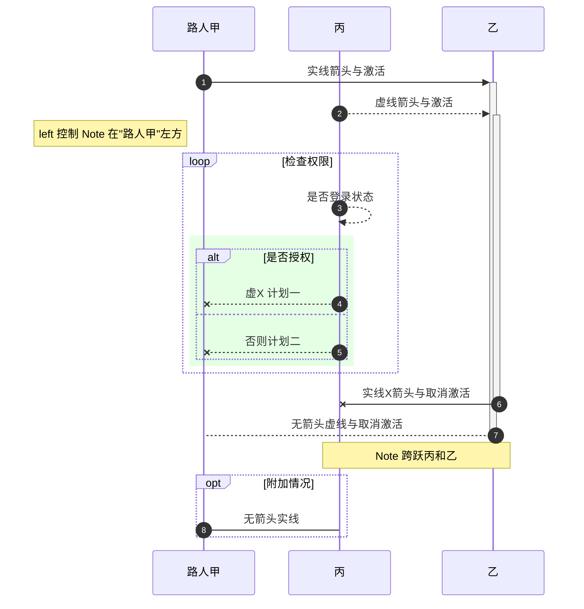
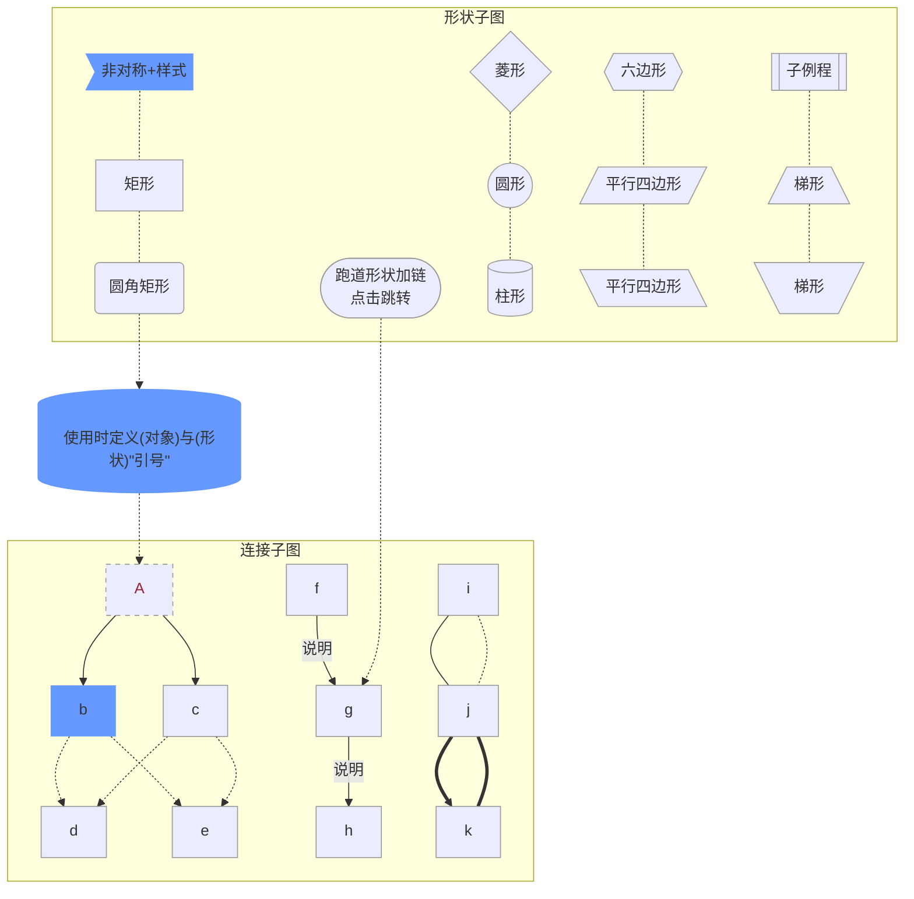

# Mermaid 示例

> [返回参考](/reference/)

## 饼图

```
pie title 标题
         "数据A" : 120
         "数据B" : 40
```



## 时序图

* **连接线**

    Type | Description
    -----|--------------------------------------------
    ->   | Solid line without arrow
    -->  | Dotted line without arrow
    ->>  | Solid line with arrowhead
    -->> | Dotted line with arrowhead
    -x   | Solid line with a cross at the end (async)
    --x  | Dotted line with a cross at the end (async)

* **注解(note)**

```
sequenceDiagram
    participant John
    participant Ken
    Note right of John: Text in note
    Note over Ken: Text in note
    Note over John,Ken: Text in note
```

* **循环(loop)**

```
loop Loop text
... statements ...
end
```

* **替代方案(alternative) 即 if/else**

```
alt Describing text
... statements ...
else
... statements ...
end
```

* **可选方案(optional) 即 if without else**

```
opt Describing text
... statements ...
end
```

* **同时进行(parallel)**

```
par [Action 1]
... statements ...
and [Action 2]
... statements ...
and [Action N]
... statements ...
end
```

* **背景高亮**

```
rect rgb(0, 255, 0)
... content ...
end
```

```
rect rgba(0, 0, 255, .1)
... content ...
end
```

* **序列编号**

```
sequenceDiagram
    autonumber
    ... content ...
```

* **示例**

```
sequenceDiagram
    autonumber
    %% 提前定义参与者可以限定对象展示顺序
    participant sky as 路人甲
    participant may as 丙
    participant 乙

    %% 箭头后边跟 `+` 表示激活目标对象，跟 `-` 表示取消激活箭头起始对象
    %% 等同于在后边跟上命令：`activate <Actor>` 或 `deactivate <Actor>`
    sky ->>+ 乙: 实线箭头与激活
    may -->>+ 乙: 虚线箭头与激活
    Note left of sky: left 控制 Note 在"路人甲"左方
    %% 这是一个循环
    loop 检查权限
            may -->> may: 是否登录状态
            %% 条件判断
        rect rgba(0, 255, 0, .1)
            alt 是否授权
                may --x sky: 虚X 计划一
            else
                may --x sky: 否则计划二
            end
        end
    end
    乙 -x- may: 实线X箭头与取消激活
    乙 -->- sky: 无箭头虚线与取消激活
    Note over may,乙: Note 跨跃丙和乙
    opt 附加情况
        sky -> may: 无箭头实线
    end
```




## 流程图

```
graph LR
    %% LR 表示左右，TD/TB 表示上下
    %% 这里是注释不会显示到图中

    %% 可提前定义对象与形状
    asymetric>非对称+样式]
    circle((圆形))
    roundrect(圆角矩形)
    rectangle[矩形]
    rhombus{菱形}
    stadium([跑道形状加链<br/>点击跳转])
    subroutine[[子例程]]
    cylindrical[(柱形)]
    hexagon{{六边形}}
    parallelogram[/平行四边形/]
    alt-parallelogram[\平行四边形\]
    trapezoid[/梯形\]
    alt-trapezoid[\梯形/]

    subgraph subid1 [形状子图]
        asymetric -.- rectangle -.- roundrect
        rhombus -.- circle -.- cylindrical
        hexagon -.- parallelogram -.- alt-parallelogram
        subroutine -.- trapezoid -.- alt-trapezoid
        stadium
    end
    subgraph 连接子图
        %% a 使用 A 为外部名称, b 应用了 classbbb 样式
        %% & 表示同时连接到多个对象
        %% -->  表示 实线有方向连接
        %% ---  表示 实线无方向连接
        %% -.-> 表示 虚线有方向连接
        %% -.-  表示 虚线无方向连接
        %% ==>  表示 实线有方向加重连接
        %% ===  表示 实线无方向加重连接
        a[A] --> b:::classbbb & c -.-> d & e
        f -->|说明|g -- 说明 --> h
        i --- j ==> k
        i -.- j === k
    end
    roundrect -.-> Bridge[("使用时定义(对象)与(形状)#quot;引号#quot;")] -.-> a
    stadium -.-> g

    %% 定义样式与类及其应用
    classDef classbbb fill:#69f,stroke:#666,stroke-width:0px;
    class asymetric,Bridge classbbb
    style a color:#923,stroke-dasharray:5,5;
    %% 默认样式
    classDef default fill:#ececff,stroke:#999,stroke-width:1px;

    %% 定义行为，Tooltip暂不生效
    click a callback "Tooltip for a callback"
    click stadium "/#/reference/" "This is a tooltip for a link"
```

